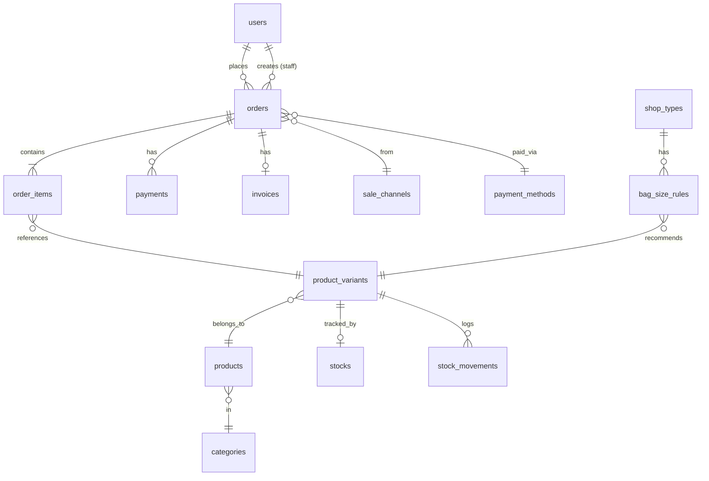

# Data Structure (Database Schema)

Database: **MySQL**. All tables use Laravel conventions (`id` bigint auto-increment PK, `created_at`/`updated_at` timestamps unless noted).

## 1. Entity Relationship Overview

## 2. Tables

### 2.1 `users`
| Column | Type | Notes |
|--------|------|-------|
| id | bigint PK | |
| name | varchar(255) | |
| email | varchar(255) nullable | unique |
| phone | varchar(50) nullable | |
| password | varchar(255) | hashed (bcrypt) |
| role | enum(`admin`,`sales_staff`,`customer`) | default `customer` |
| is_active | boolean | default true |
| created_at / updated_at | timestamps | |

### 2.2 `categories`
| Column | Type | Notes |
|--------|------|-------|
| id | bigint PK | |
| name | varchar(255) | |
| slug | varchar(255) | unique |
| parent_id | bigint nullable | FK → categories.id |
| sort_order | int | default 0 |
| timestamps | | |

### 2.3 `products`
| Column | Type | Notes |
|--------|------|-------|
| id | bigint PK | |
| category_id | bigint | FK → categories.id |
| name | varchar(255) | |
| description | text nullable | |
| origin | enum(`local`,`import`) | |
| sku | varchar(100) | unique |
| is_active | boolean | default true |
| timestamps | | |

### 2.4 `product_variants`
| Column | Type | Notes |
|--------|------|-------|
| id | bigint PK | |
| product_id | bigint | FK → products.id |
| size | varchar(50) nullable | e.g. `17x30`, `25x35` |
| color | varchar(50) nullable | |
| thickness | varchar(50) nullable | |
| unit_price | decimal(12,2) | price per unit (MMK) |
| pack_price | decimal(12,2) | price per pack (MMK) |
| sku | varchar(100) | unique |
| is_active | boolean | default true |
| timestamps | | |

### 2.5 `stocks`
| Column | Type | Notes |
|--------|------|-------|
| id | bigint PK | |
| product_variant_id | bigint | FK → product_variants.id, unique |
| quantity | int | default 0 |
| timestamps | | |

### 2.6 `stock_movements`
| Column | Type | Notes |
|--------|------|-------|
| id | bigint PK | |
| product_variant_id | bigint | FK → product_variants.id |
| type | enum(`in`,`out`,`adjust`) | |
| quantity_change | int | signed |
| reference_type / reference_id | string / bigint nullable | e.g. order, manual |
| note | text nullable | |
| created_by | bigint nullable | FK → users.id |
| timestamps | | |

### 2.7 `sale_channels`
| Column | Type | Notes |
|--------|------|-------|
| id | bigint PK | |
| name | varchar(100) | |
| code | varchar(50) | unique (`website`,`facebook`,`tiktok`,`walk_in`,`phone`) |
| is_active | boolean | default true |
| timestamps | | |

### 2.8 `payment_methods`
| Column | Type | Notes |
|--------|------|-------|
| id | bigint PK | |
| name | varchar(100) | |
| code | varchar(50) | unique (`cod`,`kpay`,`wave`, …) |
| is_active | boolean | default true |
| sort_order | int | default 0 |
| timestamps | | |

### 2.9 `orders`
| Column | Type | Notes |
|--------|------|-------|
| id | bigint PK | |
| order_number | varchar(50) | unique, generated |
| customer_id | bigint | FK → users.id |
| staff_id | bigint nullable | FK → users.id (manual order creator) |
| sale_channel_id | bigint | FK → sale_channels.id |
| payment_method_id | bigint nullable | FK → payment_methods.id |
| status | enum(`pending`,`confirmed`,`processing`,`shipped`,`delivered`,`cancelled`) | default `pending` |
| payment_status | enum(`unpaid`,`partial`,`paid`) | default `unpaid` |
| subtotal | decimal(12,2) | |
| discount | decimal(12,2) | default 0 |
| shipping_fee | decimal(12,2) | default 0 |
| total | decimal(12,2) | |
| delivery_name | varchar(255) nullable | |
| delivery_phone | varchar(50) nullable | |
| delivery_address | text nullable | |
| delivery_note | text nullable | |
| notes | text nullable | |
| timestamps | | |

### 2.10 `order_items`
| Column | Type | Notes |
|--------|------|-------|
| id | bigint PK | |
| order_id | bigint | FK → orders.id |
| product_variant_id | bigint | FK → product_variants.id |
| product_name | varchar(255) | snapshot |
| variant_label | varchar(255) nullable | snapshot (size/color/thickness) |
| sku | varchar(100) | snapshot |
| unit_type | enum(`unit`,`pack`) | which price applies |
| quantity | int | positive |
| unit_price | decimal(12,2) | snapshot of unit/pack price |
| subtotal | decimal(12,2) | quantity × unit_price |
| timestamps | | |

### 2.11 `payments`
| Column | Type | Notes |
|--------|------|-------|
| id | bigint PK | |
| order_id | bigint | FK → orders.id |
| payment_method_id | bigint | FK → payment_methods.id |
| amount | decimal(12,2) | |
| status | enum(`pending`,`completed`,`failed`,`refunded`) | default `pending` |
| reference | varchar(255) nullable | transaction reference |
| paid_at | datetime nullable | |
| recorded_by | bigint | FK → users.id |
| timestamps | | |

### 2.12 `invoices`
| Column | Type | Notes |
|--------|------|-------|
| id | bigint PK | |
| order_id | bigint | FK → orders.id |
| invoice_number | varchar(50) | unique, generated |
| status | enum(`draft`,`issued`,`void`) | default `draft` |
| total | decimal(12,2) | |
| issued_at | datetime nullable | |
| timestamps | | |

### 2.13 `shop_types` (bag size finder)
| Column | Type | Notes |
|--------|------|-------|
| id | bigint PK | |
| name | varchar(100) | e.g. Clothing Shop, Shoe Shop |
| code | varchar(50) | unique (`clothing`,`shoe`, …) |
| is_active | boolean | default true |
| timestamps | | |

### 2.14 `bag_size_rules` (bag size finder mapping)
| Column | Type | Notes |
|--------|------|-------|
| id | bigint PK | |
| shop_type_id | bigint | FK → shop_types.id |
| size | varchar(50) | input size (e.g. `17x30`) |
| product_variant_id | bigint | FK → product_variants.id (recommended bag) |
| timestamps | | |

> Unique constraint: `(shop_type_id, size)`.

### 2.15 Framework tables (Laravel defaults)
- `migrations`
- `password_reset_tokens`
- `personal_access_tokens` (Sanctum)

## 3. Seed Data

| Table | Default rows |
|-------|--------------|
| `users` | 1 admin account (e.g. `admin@example.com`) |
| `categories` | Delivery Bags, Delivery Stickers, Bubble Wrap |
| `sale_channels` | website, facebook, tiktok, walk_in, phone |
| `payment_methods` | cod, kpay, wave |
| `shop_types` | clothing, shoe *(example — confirm full list)* |
| `bag_size_rules` | example mappings *(confirm full list)* |

## 4. Indexes

- `users.email` (unique), `users.phone`
- `categories.slug` (unique)
- `products.sku` (unique), `products.category_id`
- `product_variants.sku` (unique), `product_variants.product_id`
- `stocks.product_variant_id` (unique)
- `orders.order_number` (unique), `orders.customer_id`, `orders.status`, `orders.created_at`
- `order_items.order_id`, `order_items.product_variant_id`
- `payments.order_id`
- `invoices.order_id`, `invoices.invoice_number` (unique)
- `bag_size_rules.shop_type_id` + `size` (composite unique)

## 5. Notes

- `orders.payment_status` is **denormalized** for fast reporting; the `payments` table is the source of truth for individual transactions. Keep them in sync when a payment is recorded.
- Order and order item line values (`product_name`, `variant_label`, `sku`, `unit_price`) are **snapshots** so history is stable even if the product changes later.
- Use `softDeletes` on `orders`, `products`, and `product_variants` if preserving history after deletion is required.
